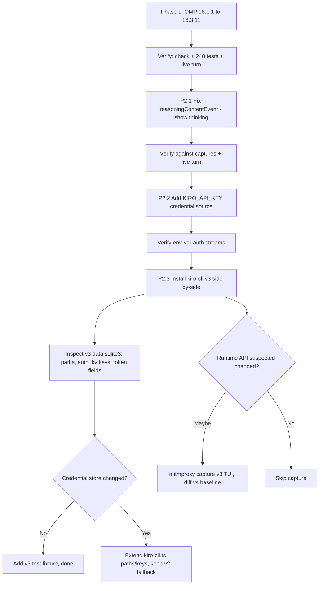

# omp-provider-kiro — Migration Research (OMP-latest + kiro-cli v3)

> Research & analysis only. No implementation. Captures the grounded findings
> for two migration axes: (1) upgrading to the latest OMP, and (2) supporting
> kiro-cli v3. All claims below are grounded in repo files, the live kiro-cli
> SQLite DB, decoded network captures in `kiro-capture/`, and the official Kiro
> docs — not from memory or unverified web grounding.

Date: 2026-07-08
Author: research pass (Kiro)

---

## TL;DR

- The extension is **already OMP-native** and **already on the current Kiro API**
  (`runtime.{region}.kiro.dev` / `GenerateAssistantResponse`). The stale
  `AGENTS.md` snapshot understates its state.
- **Do OMP-latest first** (16.1.1 → 16.3.11): minor bump, no provider-extension
  breaking changes in the surfaces the extension uses. Low-risk, independently
  testable.
- **kiro-cli v3 auth migration is CONFIRMED near-zero work.** After a full
  logout + `kiro-cli --v3 login` (2026-07-08, IAM Identity Center), the v3
  credential store is byte-for-byte compatible with what the extension reads:
  same `data.sqlite3` path, same `auth_kv` table, same `kirocli:odic:*` keys,
  same token JSON field names, same schema version. v3's documented breaking
  changes are all agent-harness concerns (permissions, hooks, sessions, agent
  config) — none touch the credential store. The auth axis is done; only the
  wire/API check remains.
- **Biggest phase-2 win is unrelated to v3:** the extension silently drops the
  Kiro `reasoningContentEvent` stream, which is why thinking is never shown.
  Fixable today against existing captures.
- **`KIRO_API_KEY`** is a new, version-independent credential path worth adding —
  no SQLite reading, no OAuth device flow.

---

## 1. Verified current state

### 1.1 Extension is OMP-native

`package.json`:
- name `omp-provider-kiro`, esbuild bundle, `omp.extensions` + `pi.extensions`
  both point at `dist/index.js`.
- Pinned to `@oh-my-pi/pi-ai@16.1.1` and `@oh-my-pi/pi-coding-agent@16.1.1`
  (devDeps). Installed `node_modules/@oh-my-pi/pi-ai` = **16.1.1**.

`src/index.ts` registers via `pi.registerProvider("kiro", { api: "kiro-api",
streamSimple, oauth: { login, refreshToken, getApiKey, getCliCredentials,
modifyModels, fetchUsage } as any, ... })`.

Note: the `as any` on `oauth` is load-bearing — the current OMP
`ProviderConfigInput.oauth` type declares only `{ name, login, refreshToken,
getApiKey, modifyModels }`. It does **not** type `getCliCredentials` or
`fetchUsage`. A repo-wide grep of the fork found **no runtime consumer of
`getCliCredentials`**, so that field may be dead under current OMP — verify
during the OMP bump.

### 1.2 Extension is already on the current Kiro API

`src/models.ts`:
- `endpointForApiRegion` → `https://runtime.{region}.kiro.dev/`
- `managementEndpointForApiRegion` → `https://management.{region}.kiro.dev/`
- `q.{region}.amazonaws.com` retained only for resolving legacy cached
  auth-meta values.

`src/stream.ts`: `X-Amz-Target: AmazonCodeWhispererStreamingService.GenerateAssistantResponse`,
request body shaped as `conversationState { conversationId, history[],
currentMessage.userInputMessage }`. Confirmed against capture
`kiro-capture/13-POST-runtime.eu-central-1.kiro.dev.request.json`.

Git log confirms `feat: migrate to current Kiro API (kiro.dev) + official
adaptive thinking` already landed.

### 1.3 kiro-cli coupling is narrow and verified

The only hard dependency on kiro-cli is `src/kiro-cli.ts` reading/writing the
SQLite credential store. Live inspection of the installed DB
(`C:\Users\Yassin\AppData\Local\Kiro-Cli\data.sqlite3`, kiro-cli **2.11.1**):

- Tables: `migrations, history, auth_kv, state, conversations,
  conversations_v2, extracted_kas_versions`
- `auth_kv` keys present: `kirocli:odic:token`, `kirocli:odic:device-registration`
  (note the `odic` typo — the extension matches it exactly)
- Token JSON fields: `access_token, refresh_token, expires_at, region, scopes,
  start_url, oauth_flow`
- Device-registration fields: `client_id, client_secret,
  client_secret_expires_at, oauth_flow, region, scopes`

These exactly match what `tryKiroCliToken()` reads. The extension works against
the installed kiro-cli today.

---

## 2. Axis A — OMP-latest (16.1.1 → 16.3.11)

**Verdict: do this first. Minor bump, no extension-facing breaking changes.**

Reviewed the full `packages/ai/CHANGELOG.md` in the fork. Breaking changes in the
16.1.1 → 16.3.11 window are confined to areas the extension does not import:

- 16.2.0 — removed `@oh-my-pi/pi-ai/utils/json-parse` (helpers moved to
  `pi-utils`). Extension does not import it.
- 16.2.x — removed Pi dialect support/serialization. Not used.
- 16.0.0 (sibling releases) — grammar → dialect rename, schema-util renames.
  Not in the extension's import surface.

Extension-facing surface that remains intact: `registerProvider`,
`ProviderConfigInput.oauth`, `streamSimple`, `Effort`, `SimpleStreamOptions`,
`createAssistantMessageEventStream`, `toolWireSchema`
(`@oh-my-pi/pi-ai/utils/schema/wire`, imported by `convertToolsToKiro` and
inlined by vitest per `vitest.config.ts`).

Independence: OMP compatibility lives in `index.ts` / `transform.ts` /
`stream.ts` / `models.ts`; kiro-cli compatibility lives almost entirely in
`kiro-cli.ts`. The two axes are nearly independent, so separate PRs keep blast
radius and bisectability clean.

Suggested steps (not yet executed):
1. Bump the two `@oh-my-pi` devDeps to 16.3.11.
2. `npm run check` (tsc --noEmit) — watch the `as any` in `index.ts` and the
   `toolWireSchema` import path.
3. Run the test suite (248 tests).
4. Confirm a live streaming turn.
5. Verify whether `getCliCredentials` is now dead under OMP; if so, note/remove.

---

## 3. Axis B — kiro-cli v3

### 3.1 What v3 actually changes (from official docs)

Sources: `kiro.dev/docs/cli/v3/`, `kiro.dev/changelog/cli/2-8/` (v3 early access,
shipped in kiro-cli **2.8.0**, opt-in via `kiro-cli --v3`, runs alongside 2.x).

v3 is the same unified agent server that powers Kiro IDE and Kiro Web, hitting
the same Kiro API. Documented breaking changes — **none touch the extension's
credential coupling:**

| v3 breaking change | Affects extension? |
|---|---|
| `permissions.yaml` replaces `--trust-all-tools` / `/tools trust` | No |
| Hooks → standalone `.kiro/hooks/*.json`, PascalCase triggers | No |
| Agent config: tags replace tool IDs, `permissions` replaces `toolsSettings`, Markdown format | No |
| `aws_tool` removed (use MCP servers) | No |
| Session format (`~/.kiro/sessions/`) not backward-compatible | No — extension never reads sessions |
| Supervised mode removed | No |

Documented v3 "known gaps" relevant to *capturing* v3 traffic (not to the
extension's runtime):
- Not supported on Amazon Linux 2.
- **Classic non-TUI mode (`kiro-cli chat` without TUI) does not support the v3
  engine — must use the TUI.** Relevant only when scripting v3 for a capture.
- v3 sessions can't be resumed in v2.

The extension talks to the Kiro **API** directly, not through kiro-cli's chat
loop, so the TUI/classic-mode and session constraints do not affect it.

### 3.2 CONFIRMED: v3 credential store is unchanged

Verified 2026-07-08 after a full logout + `kiro-cli --v3 login` (IAM Identity
Center login). The v3 credential store is identical to the pre-v3 baseline in
every field the extension reads:

| Aspect | Pre-v3 (2.11.1) | After `kiro-cli --v3 login` | Changed? |
|---|---|---|---|
| DB path | `%LOCALAPPDATA%\Kiro-Cli\data.sqlite3` | same | No |
| Tables | `migrations, history, auth_kv, state, conversations, conversations_v2, extracted_kas_versions` | identical | No |
| `auth_kv` keys | `kirocli:odic:token`, `kirocli:odic:device-registration` | identical | No |
| Token fields | `access_token, refresh_token, expires_at, region, scopes, start_url, oauth_flow` | identical | No |
| Device-reg fields | `client_id, client_secret, client_secret_expires_at, region, scopes, oauth_flow` | identical | No |
| Schema version | migrations count 10, last version 9 | identical | No |

Every field `tryKiroCliToken()` touches is present and unchanged. Incidental
observations (not blockers):
- The v3 login used **IAM Identity Center** (`start_url:
  https://d-…​.awsapps.com/start`), mapping to the extension's `idc` auth method
  — the preferred path (has `client_id`/`client_secret` for refresh).
- `oauth_flow: "Pkce"` is present but the extension does not read it.
- `profile_arn` is absent from this IdC token JSON; `tryKiroCliToken()` already
  treats it as optional and back-derives region from `start_url`/scopes, so this
  is handled.
- Note the historical `odic` typo in the key names persists in v3 — the
  extension matches it exactly.

Web grounding had been contradictory on token keys (one source claimed
`kirocli:external-idp:token`, which does **not** match the live DB) — that
grounding was noise; the live DB is authoritative.

Inspection recipe used (Bun/Node, mirrors the extension's own path):
```js
const { Database } = await import("bun:sqlite"); // or node:sqlite DatabaseSync
const db = new Database("<v3 data.sqlite3>", { readOnly: true });
db.query("SELECT key FROM auth_kv").all();
```

Decision tree (outcome: **Store unchanged** branch taken):
- **Store unchanged** (CONFIRMED) → near-zero work. Optionally add a v3 test
  fixture; the existing `getKiroCliCredentials` multi-key fallback already covers
  it. No `kiro-cli.ts` change required for auth.
- **Keys/paths renamed** (did not occur) → would have been a localized change in
  `kiro-cli.ts` (`getKiroCliDbPath()` candidates + `TOKEN_KEY_BY_AUTH_METHOD` +
  `tryKiroCliToken()` parsing), keeping v2 paths as fallback.
- **SQLite abandoned for the token** (did not occur) → larger, still isolated to
  `kiro-cli.ts`; the OAuth device-code path (`oauth.ts`) is the
  version-independent fallback.

### 3.3 Do we need network captures? Which tools?

- **Auth migration: SQLite inspection is the primary tool, not capture.** The
  coupling is the local credential DB, not the wire protocol.
- **Wire check (only if v3 is suspected to change the runtime API):** use the
  in-repo mitmproxy addon `kiro-capture/kiro_capture.py` (captures `*.kiro.dev` /
  `*.amazonaws.com`, redacts auth). Run kiro-cli **v3 (TUI)** through mitmproxy,
  do one chat turn, and diff the `GenerateAssistantResponse` request + the event
  type set against the v2 baseline already in `kiro-capture/`. Since v3 hits the
  same `runtime.{region}.kiro.dev` endpoint via the same agent server, no wire
  change is expected — capture confirms it.

### 3.4 Wire-capture runbook (v3 TUI, Windows) — ready to run

Goal: one short v3 turn through mitmproxy to confirm (a) endpoint/host/target,
(b) request body shape, and (c) the event-type set incl. `reasoningContentEvent`.
Kept to ~1 turn to minimize Kiro credit spend.

**Roles:** the human runs steps 1–6 (interactive TUI + credit spend + OS-level
CA trust cannot be automated). The agent does step 7 (decode + diff) and records
the result here.

**Why the CA-trust dance:** kiro-cli is a Rust binary. API calls go through
`aws-sdk-rust` (per the captured user-agent `aws-sdk-rust/1.3.15 …
app/AmazonQ-For-CLI`), which uses bundled roots and ignores the Windows cert
store. A plain MITM fails cert validation unless the proxy CA is pointed at
explicitly. Auth calls (reqwest → `oidc.*.amazonaws.com`,
`prod.*.auth.desktop.kiro.dev`) use a different stack, so set BOTH env vars.

1. **Install + first-run mitmproxy** (generates the CA at
   `%USERPROFILE%\.mitmproxy\mitmproxy-ca-cert.pem`):
   ```powershell
   pip install mitmproxy
   mitmdump   # run once, then Ctrl-C, just to generate the CA files
   ```
2. **Start the capture** with the in-repo addon (targets `*.kiro.dev` /
   `*.amazonaws.com`, redacts auth; writes numbered request/response files into
   `kiro-capture/`):
   ```powershell
   cd C:\Users\Yassin\Dev\omp-kiro-extension
   mitmdump -s kiro-capture\kiro_capture.py -p 8080
   ```
   Leave this running in its own terminal.
3. **In a second terminal, point kiro-cli at the proxy + trust the CA.** Set all
   of these in the SAME shell that will run kiro-cli:
   ```powershell
   $ca = "$env:USERPROFILE\.mitmproxy\mitmproxy-ca-cert.pem"
   $env:HTTPS_PROXY = "http://127.0.0.1:8080"
   $env:HTTP_PROXY  = "http://127.0.0.1:8080"
   $env:AWS_CA_BUNDLE = $ca     # aws-sdk-rust → runtime.*.kiro.dev / CodeWhisperer
   $env:SSL_CERT_FILE = $ca     # reqwest → oidc.*.amazonaws.com / auth.desktop.kiro.dev
   ```
4. **Run the v3 engine in the TUI** (classic `--no-interactive` does NOT use the
   v3 engine — must be the TUI):
   ```powershell
   kiro-cli --v3
   ```
   Pick a **reasoning-capable Claude model** (Sonnet/Opus) — only those emit
   `reasoningContentEvent`. Display is on by default (`chat.showThinking`); no
   flag needed, and the experimental thinking *tool* is NOT required.
5. **Send exactly one low-token, forced-reasoning prompt**, then exit:
   ```
   Think step by step, then answer in ONE word: a bat and a ball cost $1.10
   total, the bat costs $1 more than the ball — what does the ball cost?
   ```
   This produces many `reasoningContentEvent` frames and ~1 token of answer.
   One turn is sufficient. (Optional: also capture `kiro-cli --v3 login` through
   the proxy to see the OIDC/token endpoints — but a token *refresh* only fires
   near expiry, so don't chase it; §3.2 already settled auth.)
6. **Stop the capture** (Ctrl-C the mitmdump terminal). New numbered files now
   sit in `kiro-capture/` alongside the v2 baseline.

   **If step 3–4 fails with a TLS/cert/pinning error** (aws-sdk-rust may hard-pin
   roots): do NOT fight it. Fall back to capturing the **extension's own** Node
   traffic instead — Node honors `NODE_EXTRA_CA_CERTS` + `HTTPS_PROXY` and the
   extension already has `KIRO_DEBUG` structured logging. That captures the exact
   wire the extension will use, which is what actually matters. Note the failure
   here and switch tracks.

7. **(Agent) Decode + diff.** Extract event-type names and request shape from the
   new `kiro-capture/*runtime*` files (AWS eventstream framing:
   `:event-type\x07\x00.<name>`), then diff against the v2 baseline:
   - Host/endpoint still `runtime.{region}.kiro.dev`?
   - `X-Amz-Target` still `AmazonCodeWhispererStreamingService.GenerateAssistantResponse`?
   - Body still `conversationState { conversationId, history[],
     currentMessage.userInputMessage }`? Any new required fields?
   - Event set still `assistantResponseEvent` / `reasoningContentEvent`
     (`{"text":...}` + `{"signature":...}`) / `contextUsageEvent`?
   Record the outcome in §3.5 below.

### 3.5 Wire-capture result (v3)

> PENDING — fill in after the §3.4 run. Expected outcome: no wire change (v3 is
> the same agent server hitting the same `runtime.{region}.kiro.dev` endpoint).
> Prior (unconfirmed): endpoint/target/body/event-set all match the v2 baseline.

---

## 4. Phase-2 opportunity: thinking display is broken (independent of v3)

### 4.1 Root cause (proven from captures)

The Kiro thinking doc (`kiro.dev/docs/cli/experimental/thinking/`) distinguishes:
- **Thinking display** (`chat.showThinking`) — streams the model's own reasoning
  blocks inline; enabled by default in kiro-cli.
- **Thinking tool** (`chat.enableThinking`) — an experimental tool the model
  calls to reason in visible text.

Decoding the binary AWS eventstream frames in `kiro-capture/*runtime*.response.txt`,
the runtime emits these event types:

```
initial-response | reasoningContentEvent (×41) | assistantResponseEvent (×278) | contextUsageEvent
```

- `assistantResponseEvent` → `{"content": "..."}` — answer text.
- `reasoningContentEvent` → `{"text": "..."}` and `{"signature": "Eq..."}` —
  the model's native reasoning stream (`signature` is an Anthropic
  thinking-block signature).

`src/event-parser.ts` `parseKiroEvent()` only handles `content`,
`name/toolUseId`, `input`, `stop`, `contextUsagePercentage`, `followupPrompt`,
`usage`, `error`. **There is no `reasoningContentEvent` case** — those
`{"text":...}` / `{"signature":...}` frames fall through to `return null` and
are silently dropped.

`src/thinking-parser.ts` (`ThinkingTagParser`) only recognizes inline
`<thinking>` / `<think>` / `<reasoning>` / `<thought>` **tags embedded in the
content text** — a legacy path. The current Kiro API delivers reasoning as a
**separate binary event**, not inline tags, so the parser never sees it. That is
why thinking is never shown.

### 4.2 Does thinking change answer quality?

Two separate concepts:
- **Showing** reasoning (display) does **not** change answer quality. The model
  already reasons; surfacing `reasoningContentEvent` just displays tokens that
  are otherwise discarded. Same answer, more visibility, negligible extra client
  cost (reasoning tokens are generated/billed regardless).
- **Adaptive thinking effort** (`output_config.effort` / `thinking` payload in
  `src/adaptive-thinking.ts`) **does** change quality — higher effort = more
  reasoning tokens = better answers on hard problems, at higher cost/latency.
  The extension **already sends this** (enabled by default, live-verified
  2026-06-12 per the file header). The effort dial works; only the *display* of
  the resulting reasoning is broken.

Net: wiring `reasoningContentEvent` into pi's reasoning/`ThinkingContent` event
path yields visible thinking with no quality change and no meaningful extra
spend. High-value, low-risk. **Needs no new capture** — the existing
`kiro-capture/*.response.txt` files already contain the frames.

---

## 5. Phase-2 opportunity: `KIRO_API_KEY` credential path

The Kiro authentication doc (`kiro.dev/docs/cli/authentication/`) documents
first-class API-key auth (Pro / Pro+ / Pro Max / Power subscribers):

```
export KIRO_API_KEY=ksk_xxxxxxxx     # bash
$env:KIRO_API_KEY = "ksk_xxxxxxxx"   # PowerShell
```

Auth precedence in kiro-cli: active browser session → `KIRO_API_KEY` → prompt.
Credits decrement from the subscription.

Relevance: this is **version-independent** (v2 and v3) and would let the
extension support a credential source that needs **no SQLite reading and no OAuth
device flow** — read one env var, send it as the bearer. Strong candidate as an
additional entry in the credential cascade; sidesteps the fragile
kiro-cli-DB coupling for users who have a key. Caveat: paid-tier feature.

---

## 6. Recommended sequence



Ordering rationale:
1. **OMP-latest first** — mechanical, low-risk, gives a green baseline before the
   riskier kiro-cli axis.
2. **P2.1 thinking display** — highest-value, fully independent of v3, provable
   against existing captures; directly answers the original concern.
3. **P2.2 `KIRO_API_KEY`** — independent, low-risk, reduces SQLite-coupling
   fragility.
4. **P2.3 v3 verification** — discovery-gated; likely trivial for auth, must be
   confirmed empirically once v3 is installed.

---

## 7. Open items / unknowns

- v3 credential storage: unconfirmed until v3 is installed (box has 2.11.1). This
  is the linchpin of the v3 auth sub-track (§3.2).
- Whether `getCliCredentials` is dead under current OMP (§1.1) — verify during
  the OMP bump.
- Whether v3 changes the runtime wire API — expected no; confirm with a mitmproxy
  diff only if suspected (§3.3).

---

## 8. Evidence index

- Live DB: `C:\Users\Yassin\AppData\Local\Kiro-Cli\data.sqlite3` (kiro-cli 2.11.1)
- Captures: `kiro-capture/*.response.txt` (v2 baseline; user-agent
  `app/AmazonQ-For-CLI appVersion-2.6.1`), `kiro-capture/13-POST-runtime.*.request.json`
- Capture tool: `kiro-capture/kiro_capture.py` (mitmproxy addon)
- Code: `src/event-parser.ts`, `src/thinking-parser.ts`, `src/adaptive-thinking.ts`,
  `src/kiro-cli.ts`, `src/models.ts`, `src/stream.ts`, `src/index.ts`
- OMP fork: `packages/ai/CHANGELOG.md`, `docs/adding-a-provider.md`,
  `docs/extensions.md`, `packages/coding-agent/src/config/model-registry.ts`
  (`ProviderConfigInput`)
- Kiro docs: `/docs/cli/v3/`, `/changelog/cli/2-8/`, `/docs/cli/authentication/`,
  `/docs/cli/experimental/thinking/`
